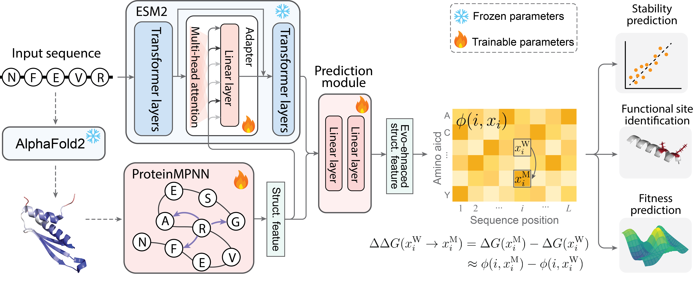

# SPURS: Rewiring protein sequence and structure generative models to enhance protein stability prediction

SPURS is a accurate, rapid, scalable, and generalizable stability predictor. This repository is an official implementation of the paper [Rewiring protein sequence and structure generative models to enhance protein stability prediction](https://www.biorxiv.org/content/10.1101/2025.02.13.638154v1).

## Environment
```shell
# get esm
conda create -n spurs python=3.7 pip
conda activate spurs


pip install -e .
pip install git+https://github.com/facebookresearch/esm.git

pip install torch==1.12.0+cu113 torchvision==0.13.0+cu113 torchaudio==0.12.0 --extra-index-url https://download.pytorch.org/whl/cu113
```

## Data
Download `data.tar.gz` from [link](https://www.dropbox.com/scl/fi/uo4e6lvptyy9df5xfulsc/data.tar.gz?rlkey=voi6fxu6ojbzwdk67jlooy8kb&st=4iinnpbc&dl=0).
```shell
tar -xzvf data.tar.gz
```

## Inference

```python
from spurs.inference import get_SPURS, parse_pdb
# ~ 10s
model, cfg = get_SPURS('./data/checkpoints/spurs')
pdb_name = 'DOCK1_MOUSE'
pdb_path = './data/inference_example/' + pdb_name + '.pdb'
chain = 'A'
pdb = parse_pdb(pdb_path, pdb_name, chain, cfg)
# ~ 1s
ddg = model(pdb,return_logist=True)
```


## Reproduce result
### Stability Prediction
Evaluation on the test sets:


```bash
# general usage, only model and test dataset should be specified.
python ./test.py  experiment_path={checkpoint_path} datamodule._target_={dataset_name} data_split=test ckpt_path=best.ckpt mode=predict 
```
while model checkpoints can be selected from [data/checkpoints](./data/checkpoints), and datamodule can be selected from `megascale` and `domainome`.
```bash
## SPURS on Megascale and ten test sets
python ./test.py  experiment_path=data/checkpoints/spurs datamodule._target_=megascale data_split=test ckpt_path=best.ckpt mode=predict 


### ThermoMPNN on Domainome
python ./test.py  experiment_path=data/checkpoints/ThermoMPNN datamodule._target_=domainome data_split=test ckpt_path=best.ckpt mode=predict 
```


Results on Megascale and ten test sets can be processed using [convert.ipynb](./notebooks/convert.ipynb)
### Functional Site Identification
An example can be found at [functional_site_identification.ipynb](./notebooks/functional_site_identification.ipynb). This is the reuslt for Fig3h in the paper (UniProt ID: P00327, PDB ID: 1QLH).

### Fitness Prediction

<!-- First change the line 13 of `${CONDA_PREFIX}/lib/python3.7/site-packages/skopt/__init__.py`
```python
from importlib.metadata import version, PackageNotFoundError
```
to 
```python
from importlib_metadata import version, PackageNotFoundError
``` -->


To run fitness prediction
```shell
cd combining-evolutionary-and-assay-labelled-data
export PROJECT_ROOT=$PWD/../
python run_proteingym.py
```
This command will use all accessible CPU cores by default. If you want to use a specific range of CPUs, such as CPU0-80, you can use:
```shell
taskset -c 0-80 python run_proteingym.py
```

SPURS-augmented models were built upon the [Augmented models](https://www.nature.com/articles/s41587-021-01146-5) framework (Hsu et al., *Nat biotechnology*, 2022). We adapted the code from the original [GitHub repo](https://github.com/chloechsu/combining-evolutionary-and-assay-labelled-data) (commit `fdaa5bb`) and retained only the necessary files. A [`DDGPredictor`](https://github.com/li-ziang/psnet-release/blob/main/combining-evolutionary-and-assay-labelled-data/src/predictors/esm_predictors.py#L14) is added to introduce predicted ddG into the regression model.


